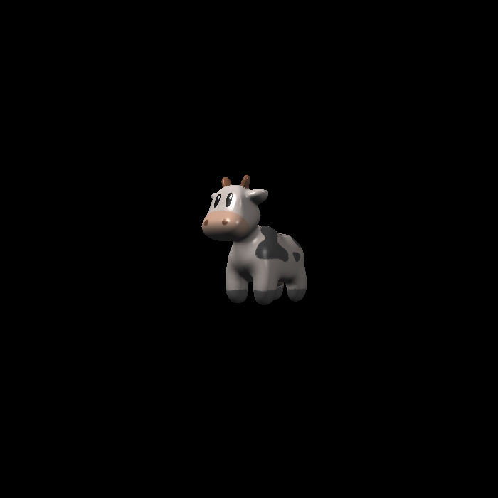

# Computer Graphics

This is my assignment for studying Games101 course.

## pan 1:

    

## pan 2:

    

## pan 3:

### normal:

    

### phong:

    

### texture:

    

### bump:

    

### displacement:

    

## pan 4:

    

